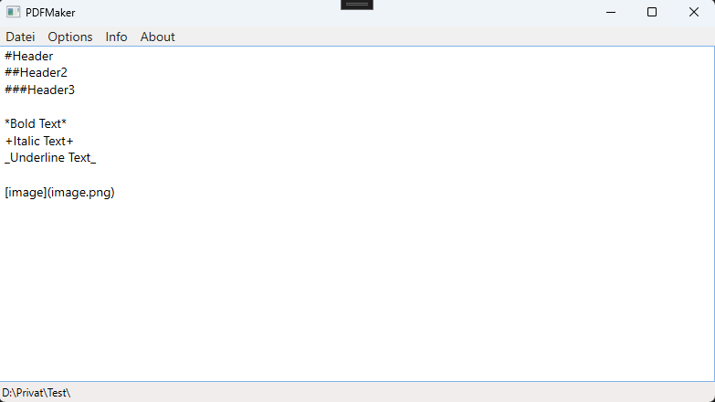

# PDFMaker
Simple PDF Maker that uses a Markdown like language

## How it works

At the Menu, there is just basic stuff like save File, open File, Settings, and Info on how to use the language.

At the moment, there is just bold, italic, underline, header text and images.

You can save the Text as a PDF Document or as a text document.

On "Show Preview", you can see how the pdf document would look like.

## Use

Feel free to use this Program for yourself. I would appreciate if you mention this repository when using it for commercial purposes.

## Contribution

Feel free to add new Features, I would look into that and approve if it looks good.